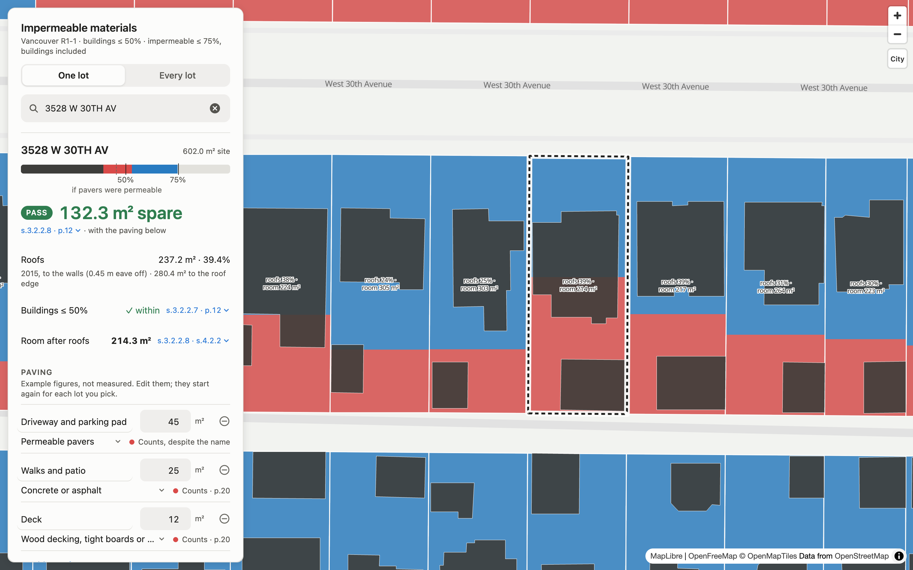
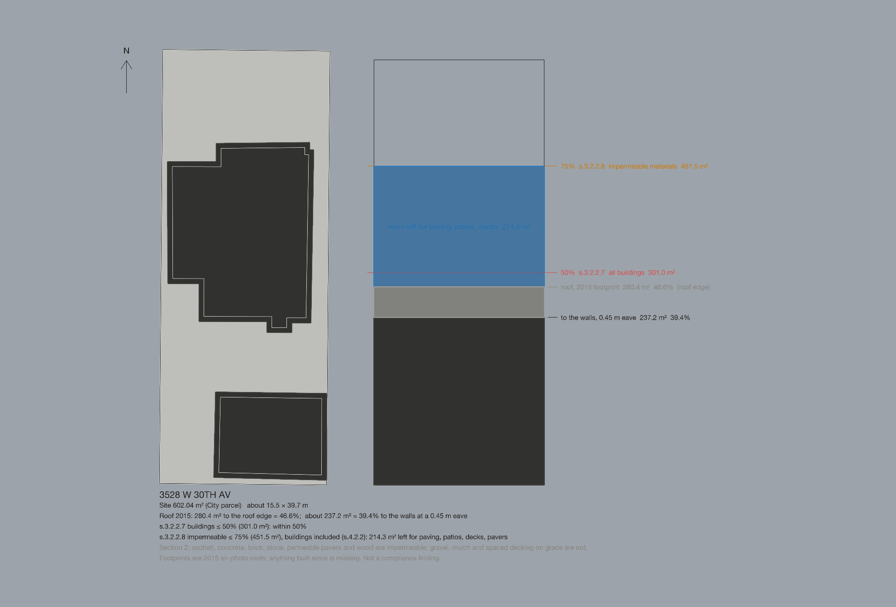

# Impermeable materials in Vancouver R1-1

**Live map: <https://kevinjinn6.github.io/arch540-impermeable-materials/>**

**ARCH 540 — Assignment 1, Making Design Knowledge Interactive**
Kevin Jinn · Instructor: Xun Liu · Phase 1, Weeks 1–4

## Purpose

<!-- Kevin: the brief says this section is written by you, 150 words or
     fewer, naming who the tool is for. The paragraph below adapts your W1
     wording to the map and runs to about 120 words; edit it or replace it,
     then delete this comment. -->

An interactive map that explains one provision of Vancouver's R1-1 District
Schedule — the 75% cap on impermeable materials — and shows, for every
ordinary R1-1 lot in the city, how much of that allowance the existing house
has already used and how much is left for driveways, walks, patios and decks.
It is for landscape designers preparing residential permit sets.

The provision is three lines long. The part worth building a tool around is
not the number but the definition behind it: under Section 2 of the Zoning and
Development By-law, **permeable pavers count as impermeable**, and **wood
decking counts as permeable only if the boards are spaced**, on grade, with
nothing under them. A designer specifying a paver driveway to improve drainage
gains nothing against this limit. The map lets you see that: set a driveway as
permeable pavers and the lot's bar reads exactly as it would for concrete; a
dotted mark shows where the lot would sit if the by-law agreed with the name.

## How to use it

**In a browser.** Open the [live map](https://kevinjinn6.github.io/arch540-impermeable-materials/).
It needs an internet connection for the basemap and loads about 8 MB
(compressed) of lot data before the lot card fills in.

1. **Pick a lot.** Click one, or start typing a civic address the City's way
   (`3528 W 30TH AV`; suggestions appear). The card leads with the answer:
   the bar is the site as 100%, marked at 50% and 75% (dark is roof, red is
   paving, blue is room, purple is over the limit), then PASS or FAIL with
   the margin in square metres. Under it: the 2015 roofs to the walls, the
   50% rule, and the room s.3.2.2.8 leaves after the roofs. Tap any blue
   reference such as *s.3.2.2.8 · p.12* to read the passage in place.
2. **Fill in what else is on the lot.** Under *Paving*, three illustrative
   surfaces are prefilled; change the material (named in the by-law's words)
   and the square metres. Each row says whether it counts, with the page;
   the pavers row says *Counts, despite the name*, and a dotted mark on the
   bar shows where the lot would sit if pavers were permeable. *Check the
   arithmetic* shows the sum to verify by hand.
3. **Try the city.** Switch to *Every lot*. The slider sets the same
   impermeable share on every lot, from an empty lot at 0% to 100%. A house
   appears once its 2015 roofs fit within that share; the mark at 75% is the
   by-law maximum, and past it every lot fails by the purple stripe. The
   purple tick is the selected lot's own roof share.
4. **Read the rule.** *The by-law, verbatim*, at the foot of the panel, holds
   s.3.2.2.7, s.3.2.2.8 and s.4.2.2 and the Section 2 definitions word for
   word with their pages in the June 2026 consolidation, then the
   assumptions and the sources.
5. **The storm card is not the by-law.** It is a Rain City Strategy water
   balance kept as context (behind *48 mm storm* in Every lot, and *Storm*
   in a lot's card), with its assumptions written beside it.

**Locally.** The page needs a small web server to load its data files:

```bash
cd map && python3 -m http.server      # then open http://localhost:8000
```

**In Rhino 8.** Type `ScriptEditor`, open `map/rhino_site.py`, set `ADDRESSES`
to the lot(s) you want, press **Run**. It draws the site, its 2015 roofs
raised to their recorded heights, the eave allowance inside each roof, and an
*area bar* beside the site marked at 50% and 75%, with the room left for
paving. Named views `R1-1 map Plan - …` and `R1-1 map Axon - …` are saved. The
script draws only on layers under `R1-1 map` and touches nothing else. macOS
may refuse Rhino access to your Documents folder the first time ("Operation
not permitted"): allow it under **System Settings → Privacy & Security →
Files and Folders**, then run again.

**Regenerating the data.** The map reads a committed snapshot. To rebuild it
from City open data (no API key; about 250 MB of downloads, a few minutes):

```bash
python3 -m venv .venv && source .venv/bin/activate
pip install -r requirements.txt
python stormwater.py          # R1-1 parcels            -> r11_stormwater.geojson
python buildings.py           # sites, 2015 roofs       -> map/data/lots.geojson, buildings.geojson
python map/roof_walls.py      # roofs to the walls      -> map/data/roof-walls.json
python3 map/check_data.py     # the figures below still hold?
```

## Source

| Document | Version | Used |
|---|---|---|
| Zoning and Development By-law No. 3575, **R1-1 District Schedule** (`sources/zoning-by-law-district-schedule-r1-1.pdf`) | June 2026 consolidation, 17 pp. | s.3.2 and s.3.2.2.1 (p.12), **s.3.2.2.7** and **s.3.2.2.8** (p.12), s.2.2.4 (p.5), **s.4.2.2** (p.16) |
| Zoning and Development By-law No. 3575, **Section 2 Definitions** (`sources/zoning-by-law-section-2.pdf`) | June 2026 consolidation, 50 pp. | **Impermeable Materials** (p.20), **Permeable Materials** (p.31), Deck (p.11), Patio (p.30), Site (p.43) |
| City of Vancouver open data | property parcel polygons (retrieved 2026-09-21), building footprints 2015 and 2009 (2026-09-25) | site outlines and areas; roof footprints; heights for the Rhino drawing only |
| Rain City Strategy (2019) | Council policy, **not a by-law** | the 48 mm daily design standard in the storm card, as context |

Every passage is quoted verbatim, with its page, in
[`sources/r1-1-impermeable-extract.md`](sources/r1-1-impermeable-extract.md),
which also records each interpretive decision and what remains unresolved.
The register of all documents, with retrieval dates and authority levels, is
[`sources/README.md`](sources/README.md).

## One example

3528 W 30th Ave, a real 602.04 m² R1-1 lot (City parcel R11-042685), as the
map opens on it:

| | | Source |
|---|---:|---|
| Site area, City parcel | 602.04 m² | parcel polygon |
| Roofs, 2015 footprints, to the roof edge | 280.4 m² · 46.6% | footprints clipped to the site |
| Roofs to the walls (0.45 m eave taken off) | 237.2 m² · 39.4% | the by-law measures walls, Section 2 p.20 |
| s.3.2.2.7 buildings ≤ 50% = 301.0 m² | within | p.12 |
| s.3.2.2.8 impermeable ≤ 75% = 451.5 m², buildings included | **214.3 m² of room** after the roofs | p.12, s.4.2.2 p.16 |
| With the illustrative schedule: 45 m² of permeable pavers, 25 m² of concrete, 12 m² of tight-board deck | 319.2 m² · 53.0% · **PASS**, 132.3 m² spare | Section 2 p.20 |
| If permeable pavers were permeable (they are not) | 45.5% | — |

Check by hand: 0.75 × 602.04 = 451.53; 451.53 − 237.22 = 214.31 m².

Citywide, with the same hard landscaping added to each of the 62,188 assessed
lots: 60 m² of concrete puts 157 lots over 75%; 90 m² puts 1,374 over; 120 m²
puts 10,944 over. The same square metres of permeable pavers give exactly the
same counts. Gravel leaves one lot over, whose roof alone exceeds 75%.

<!-- Kevin: the brief wants a screenshot of the tool itself here. Open the
     live map on 3528 W 30th Ave, screenshot the panel and the lot, save it as
     output/map-3528-w-30th-ave.png and replace this comment with
      -->



In Rhino, the **area bar** beside the site is a copy of the site as a bar: the
same width, the same area, so its depth is 100% of the site. Dark is the roof
to the walls, grey the eave strip, blue the room left under 75%.

## Skill and limits

**Skill.** [`skill/SKILL.md`](skill/SKILL.md) is a reusable procedure for
reading any R1-1 lot off this map and the by-law: what to look up, what the
numbers mean, which assumptions to say out loud, and how to check a figure
against the source by hand.

**What the tool does not do, and where a person must check:**

- **Roofs are 2015 air-photo footprints.** Anything built or demolished since
  is wrong here. They follow the roof edge; the by-law measures walls, so a
  0.45 m eave allowance is taken off for the by-law test and both figures are
  shown. Measured to the roof edge 13,581 assessed sites read over 50%;
  measured to the walls, 769. The air photo cannot tell which is right for
  any one house, so those 769 are marked *check*, not *exceedance*.
- **Driveways, patios and walks are in no City dataset.** The lot schedule
  and the slider are hypotheses you set; they are not a survey of existing
  paving. The page is not a compliance finding.
- **It checks s.3.2.2.7 and s.3.2.2.8** for uses under s.3.2 (single detached
  house, duplex and others not regulated by s.3.1). A multiplex under s.3.1
  has no impermeable-materials limit. Laneway houses are regulated by
  Section 11 (s.2.2.4), which is not in this repository; the map counts them
  as buildings.
- **A site is parcels sharing an address and an edge** (Section 2, Site).
  Sites over 2,000 m², road allowances, parcels under 150 m² and parcels the
  pipeline flagged are drawn grey and not assessed. Parcels below the 306 m²
  minimum site area of s.3.2.2.1 are assessed but labelled.
- **Two readings are the author's**, and the page says so where it relies on
  them: the on-grade, no-impermeable-layer condition applied to every listed
  permeable material; a raised deck (a *Deck* is over 600 mm, Section 2 p.11)
  counted as wood, so impermeable.
- **The split drawn inside each lot is a diagram**, a share of the lot's
  depth from the south edge, not where the surfaces are.
- **The storm card is Rain City Strategy context**, not the by-law. The R1-1
  schedule sets no retention requirement; 85% runoff and 75 mm of soil
  storage are this page's assumptions.
- It cannot know what the Director of Planning will accept as permeable.

## Reviews and revision

Three outside reviews of the live map, written cold on 2026-10-02, are in
[`docs/reviews/`](docs/reviews/): a permit-practice review, a studio-crit
review and a computational review.
[`docs/review-response-map.md`](docs/review-response-map.md) lists every
finding, what changed in response, and what was left as the author's decision.
Peer reviews from class are GitHub issues on this repository.

---

## Repository map

```
README.md                     you are here
map/
  index.html                  THE TOOL: the map, one lot's card and schedule, the citywide slider
  rhino_site.py               draws any lot from the map's data in Rhino 8
  roof_walls.py               roof area to the walls per site -> data/roof-walls.json
  check_data.py               smoke test of the data files; run by the Pages workflow
  data/                       the published snapshot: lots.geojson, buildings.geojson, roof-walls.json
buildings.py                  the pipeline: parcels -> sites, 2015 roofs clipped and summed
stormwater.py                 Stage 1: finds the R1-1 parcels (and a citywide stormwater analysis)
requirements.txt              pinned versions for the pipeline
skill/SKILL.md                the reusable skill
sources/
  README.md                   source register: version, authority, retrieval date
  r1-1-impermeable-extract.md the passages verbatim, with pages; decisions; hand-worked examples
  *.pdf                       the by-laws themselves
output/                       Rhino captures of the example lot
docs/
  regulation-shortlist.md     preferred source + two ranked alternatives, argued (W1)
  prompt-comparison.md        W1 exercise: what changed between two prompt approaches
  reviews/                    outside reviews, 2026-10-02
  review-response-map.md      what changed in response, finding by finding
tool/                         a companion single-lot checker for the same provision: surfaces
                              named in the by-law's words, clipped to the lot, overlaps counted
                              once; terminal, web page and Rhino. See tool/impermeable_check.py.
week-01/                      the two W1 prototypes (evidence for the prompt comparison)
.github/workflows/pages.yml   publishes map/ to GitHub Pages after map/check_data.py passes
```

## Precursor: the citywide stormwater analysis

`stormwater.py` also runs a gap analysis across all R1-1 parcels against the
Rain City Strategy's 48 mm design storm. It is where this project started and
where the map's storm card comes from. Read the caveats in its file header
before quoting any number from it; the most important is that **48 mm is not
a legal requirement for R1-1**. Its large outputs (`r11_stormwater.geojson`,
`r11_stage2.geojson`, `cache/`) are not committed and are regenerated by the
commands above.

## Not in this repository

- `.venv/`, `cache/`, the two large GeoJSON intermediates — recreated by the
  commands above.
- The surveyed site plan used for real-world testing. It is a client drawing
  and is held back pending permission. The example lot is a real parcel
  carrying an illustrative schedule, so the tool can be run by anyone.
